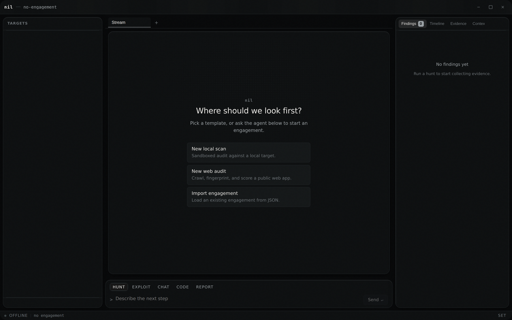
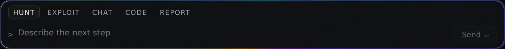

# NIL — TACTICAL WORKSTATION

A terminal-first security assessment workstation. Built with **Svelte 5**,
**TypeScript**, **SvelteKit** (static adapter), and a **Tauri** desktop shell.

The design law, in one line: **color means risk.** Chrome is a five-step
greyscale; the only saturated pixels on screen are severity values. Mono
type is the machine speaking (hosts, ports, CVEs, raw output); sans is NIL
speaking (labels, buttons, assessment prose). The full system is documented
in [`FRAMEWORK.md`](./FRAMEWORK.md) — read that before touching UI code.



## Screenshots

| Command-center home | Composer, focused |
|---|---|
|  |  |

Both captured from a real production build (`npm run build && npm run
preview`) via headless Chromium at 1440×900, 2x DPR — not mockups.

## Quick start

Download the latest release zip and run the appropriate script for your OS.

**macOS / Linux / Git Bash**
```bash
./run.sh
```

**Windows PowerShell**
```powershell
.\run.ps1
```

**Windows CMD**
```cmd
run.bat
```

Then open `http://localhost:3000`. On macOS you can also double-click `NIL
Frontend.command` in Finder (right-click → Open once, if Gatekeeper warns
about an unsigned app).

The site also auto-deploys to GitHub Pages on every release tag:
**https://dasvr.github.io/NIL/**

## Development

```bash
cd frontend
npm install
npm run dev      # Vite dev server
npm run check    # svelte-check + tsc — 0 errors, 0 warnings
npm run build    # static build to build/
```

## What's inside

- `FRAMEWORK.md` — the design system: the three laws, layout, motion
  primitives, agent-surface rules. Source of truth.
- `.cursor/rules/` — the same laws encoded for in-editor agents, plus their
  documented amendments (see `00-nil-design-language.mdc` for the two
  scoped exceptions shipped in v0.2.0).
- `frontend/src/lib/styles/tokens.css` + `motion.css` — every color, space,
  radius, and motion value in the app traces to one of these two files.
- `frontend/src/lib/components/shell/` — the workstation shell: sidebar,
  target tree, agent stream, composer, inspector, status bar, command
  palette, settings.
- `frontend/src/lib/components/ui/` — tool cards, findings, approval gate,
  window chrome.
- `frontend/src/lib/stores/*.svelte.ts` — Svelte 5 rune-based state.
- `docs/RELEASE-v0.2.0.md` — this release's dense, token-cited changelog.

## Keyboard

| Key | Action |
|---|---|
| `⌘/Ctrl K` | Command palette |
| `⌘/Ctrl J` | Focus composer |
| `⌘/Ctrl N` | New engagement |
| `⌘/Ctrl T` | New terminal tab |
| `⌘/Ctrl W` | Close active tab |
| `⌘/Ctrl 1–9` | Jump to tab N |
| `⌘/Ctrl B` | Toggle target sidebar |
| `⌘/Ctrl \` | Toggle inspector |
| `⌘/Ctrl ,` | Settings |
| `⌘/Ctrl ↵` | Approve pending tool call |
| `⌘/Ctrl ⇧ ↵` | Deny pending tool call |
| `⌘/Ctrl Y` | Toggle YOLO (auto-approve) |
| `G` | Jump agent stream to latest (outside text fields) |
| `Esc` | Close palette/settings, else focus composer |
| `↑ ↓ ← →`, `Enter`, `Space` | Target tree navigation (roving focus) |
| `Home` / `End` (on a resize handle) | Snap panel to its min/max width |

Every binding above is read directly from `frontend/src/lib/keymap.svelte.ts`
and the relevant component, not aspirational.

## Design system contract

Non-negotiable, enforced in review, documented in `FRAMEWORK.md`:

1. **Monochrome ink (Law 1).** Saturated color exists only to mean severity
   (`--sev-critical` → `--sev-info`). Everything else — panels, borders,
   text, controls — is one of the five `--nil-*` greyscale steps. As of
   v0.2.0 there are exactly two named, reviewed exceptions (a Zone A ember
   highlight, and the composer's focus ring) — both called out explicitly
   in `00-nil-design-language.mdc`; nothing else is exempt.
2. **Transform/opacity motion (Law 3).** Every animation is transform
   and/or opacity, composed from ten defined primitives (LIFT, PRESS, HALO,
   MAGNETIC, SCANLINE, TICK, REVEAL, SETTLE, TRACE, SCRAMBLE) — never a
   bespoke one-off. `SCANLINE` is the only infinite animation in the app.
   `prefers-reduced-motion` holds the final frame; it never just skips.
3. **Tabular typography.** Mono (`--font-machine`) renders anything the
   machine produced — hosts, ports, CVEs, hashes, timestamps, durations —
   in fixed-width grid cells so scanning a column of evidence doesn't
   require reading each row. Sans (`--font-ui`) is NIL's own voice: labels,
   buttons, assessment prose. Mixing the two on the same value is a bug.

## License

MIT
