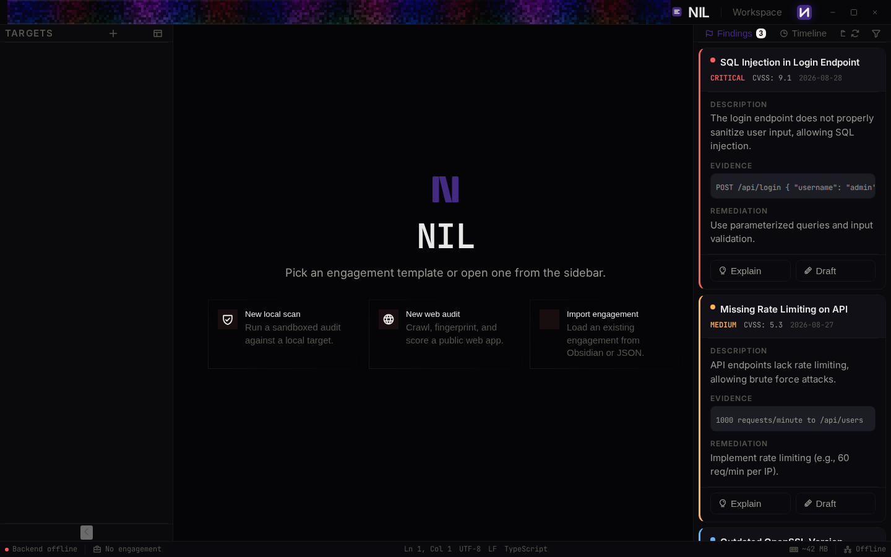
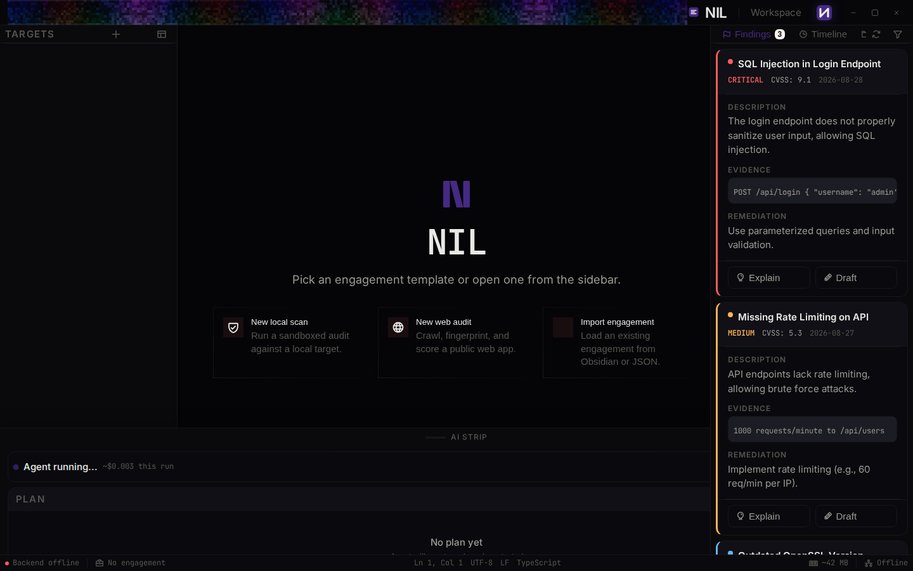
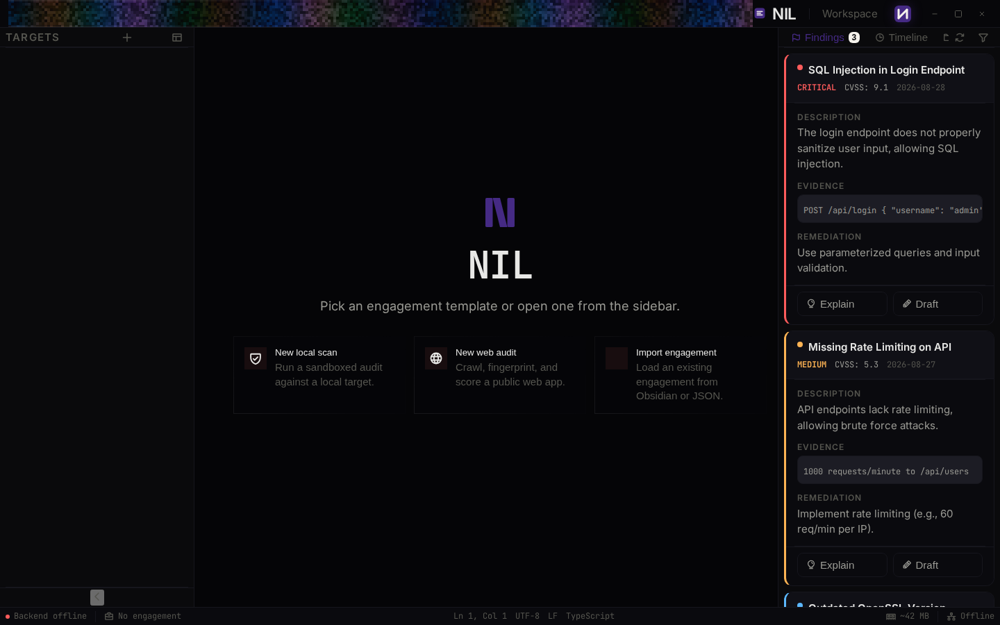

# NIL Frontend

A terminal-first, native-macOS-inspired coding agent workstation shell for the NIL project.

Built with **Svelte 5**, **TypeScript**, and **SvelteKit static adapter**. The UI is designed to feel like a macOS app: glass panels, spring physics, the NIL thinking-logo system, and a keyboard-first command palette.



## Screenshots

| Empty state | AI strip (Cmd+J) | Command palette (Cmd+K) |
|---|---|---|
|  |  |  |

## Quick start

Download the latest release zip and run the appropriate script for your OS.

### macOS / Linux / Git Bash

```bash
./run.sh
```

### Windows PowerShell

```powershell
.\run.ps1
```

### Windows CMD

```cmd
run.bat
```

Then open `http://localhost:3000` in your browser.

## macOS one-click runner

On macOS you can double-click `NIL Frontend.command` in Finder. If Gatekeeper warns about an unsigned app, right-click the file and choose **Open** once.

## GitHub Pages

The site is also auto-deployed to GitHub Pages on every release tag:

**https://dasvr.github.io/NIL/**

## Development

```bash
cd frontend
npm install
npm run dev      # Vite dev server
npm run check    # svelte-check + tsc
npm run build    # static build to build/
```

## What's inside

- `frontend/` — SvelteKit app
  - `src/lib/components/shell/` — workstation shell (sidebar, workspace, AI strip, status bar, command palette, settings)
  - `src/lib/components/ui/NilMonogram.svelte` — Zone A identity mark (cold open, lock, handoff, report cover)
  - `src/lib/components/ui/` — shared UI primitives (BorderBeam, cards, blocks)
  - `src/lib/components/shell/GrainOverlay.svelte` — shell grain, applied once
  - `src/lib/stores/*.svelte.ts` — Svelte 5 rune-based stores
  - `run.sh`, `run.bat`, `run.ps1`, `NIL Frontend.command` — local runners
  - `screenshots/` — README screenshots

## Keyboard shortcuts

| Shortcut | Action |
|---|---|
| `Cmd/Ctrl + K` | Open command palette |
| `Cmd/Ctrl + J` | Toggle AI strip |
| `Cmd/Ctrl + B` | Toggle left sidebar |
| `Cmd/Ctrl + Shift + B` | Toggle right sidebar |
| `Cmd/Ctrl + ,` | Open settings |

## License

MIT
