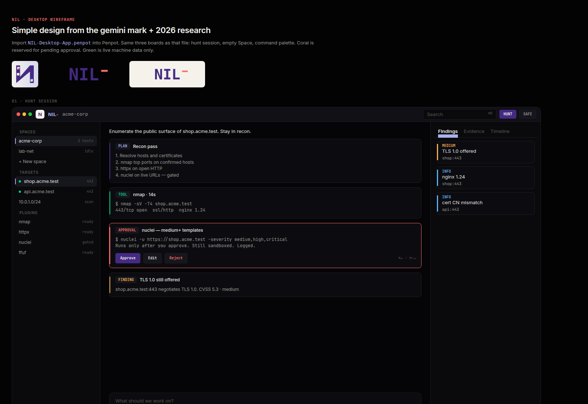

# NIL desktop — Penpot wireframe

Importable Penpot file for the **NIL** desktop app, drawn from the gemini logo and the 2026 research (agent conversation as the work surface, Linear density, Raycast palette, Warp/Cursor typed blocks).

## File

| | |
|---|---|
| **Penpot file** | [`NIL-Desktop-App.penpot`](./NIL-Desktop-App.penpot) |
| **Generator** | [`build.mjs`](./build.mjs) |
| **HTML preview** | [`preview.html`](./preview.html) (open in a browser) |
| **Hunt board** |  |

## Import

1. Open [Penpot](https://design.penpot.app/) (or a self-hosted instance).
2. **Projects → Import** (or drag the `.penpot` file onto the dashboard).
3. Open **NIL Desktop App**.

Pages:

| Page | Boards |
|---|---|
| `00 Tokens` | Logo lockups, gemini palette, type, density rules |
| `01 Desktop` | Hunt session · empty Space · command palette |
| `02 Notes` | What to keep / kill |

## Brand (from the gemini mark)

- **Violet `#452a84`** — brand, primary actions
- **Lavender `#a9b1f0`** — wordmark, active rail
- **Coral `#fe6f69`** — the dash, and the **only** attention color (pending approval)
- **Cream `#f5f2ec`** — mark tile
- **Abyss `#050507`** — work surface
- **Green `#00d992`** — live machine data only (ports, running tools), not brand

## Regen

```bash
cd design/penpot
npm install
node build.mjs
```

Needs Node 18+ (`Blob` global). Logos are read from `cursor-research/logo/`.
